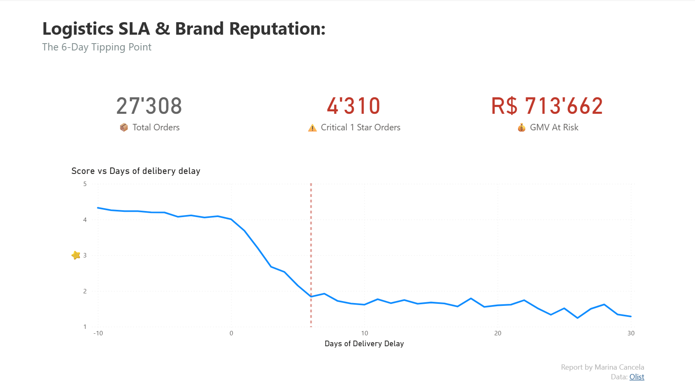
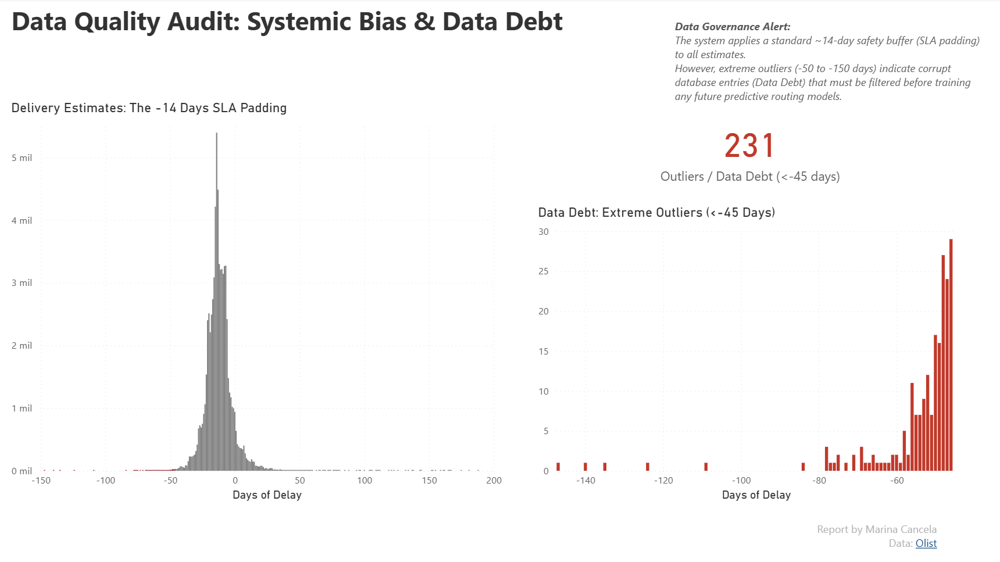

# 📦 E-Commerce Data Debt & SLA Audit

*(🇪🇸 Versión en español más abajo)*

**Data Analyst:** Marina Cancela  
**Dataset:** E-commerce Orders & Reviews (Kaggle) [(https://www.kaggle.com/datasets/olistbr/brazilian-ecommerce)]
**Tools Used:** Power BI, DAX, Data Modeling

## 🎯 Executive Summary (EN)
This project analyzes the relationship between logistics performance and customer satisfaction. Beyond standard delivery metrics, this analysis identifies the exact **"SLA Tipping Point"** where brand reputation collapses and audits the system's database to uncover hidden **Data Debt** and algorithm biases.

## ⚠️ Key Insight 1: The 6-Day Tipping Point (Financial Impact)
* **The Finding:** The average review score remains stable until a package is **6 days late**. At exactly Day 6, the score plummets to 1-star.
* **The Impact:** I quantified this "reputation bleeding". Out of 27,308 late orders, **4,310** received critical 1-star reviews, putting **$713,662 (GMV)** at direct risk of churn.
* *See Dashboard Page 1 below.*

## 🕵️‍♀️ Key Insight 2: Data Governance & Systemic Bias
Auditing the estimated delivery algorithm revealed two critical systemic failures:
1. **SLA Padding (The -14 Day Bias):** The system applies a standard ~14-day safety buffer to estimates. This artificially inflates estimated delivery times, highly likely driving massive **Cart Abandonment**.
2. **Data Debt & Corrupted Records:** I isolated **231 extreme outliers** (deliveries arriving 45 to 150 days *before* the promised date). 
* **Recommendation:** These 231 records must be strictly filtered out before feeding this dataset into any Machine Learning routing algorithms.

---
---

## 🎯 Resumen Ejecutivo (ES)
Este proyecto analiza la relación entre el rendimiento logístico y la satisfacción del cliente. Más allá de las métricas de entrega estándar, este análisis identifica el **"Punto de Quiebre del SLA"** exacto donde la reputación de la marca colapsa, y audita la base de datos para destapar la **Deuda de Datos** oculta y los sesgos del algoritmo.

## ⚠️ Insight 1: El Punto de Quiebre de los 6 Días (Impacto Financiero)
* **El Hallazgo:** La puntuación media se mantiene estable hasta que un paquete se retrasa **6 días**. Exactamente en el día 6, la puntuación cae en picado a 1 estrella.
* **El Impacto:** De 27.308 pedidos retrasados, **4.310** recibieron reseñas críticas de 1 estrella, poniendo **$713.662 (GMV)** en riesgo directo de abandono (churn).
* *Ver Página 1 del Dashboard abajo.*

## 🕵️‍♀️ Insight 2: Gobierno de Datos y Sesgo Sistémico
La auditoría del algoritmo de estimación de entregas reveló dos fallos sistémicos:
1. **SLA Padding (El Sesgo de -14 Días):** El sistema aplica un margen de seguridad estándar de ~14 días. Esto infla artificialmente los tiempos de entrega mostrados en pantalla, provocando muy probablemente un **Abandono de Carrito** masivo.
2. **Deuda de Datos y Registros Corruptos:** Aíslé **231 valores atípicos extremos** (entregas que llegaron entre 45 y 150 días *antes* de lo prometido). 
* **Recomendación:** Estos 231 registros deben ser filtrados estrictamente antes de entrenar cualquier modelo predictivo de Machine Learning.

---
### 📊 Dashboards

